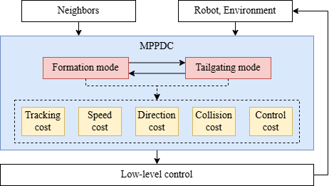

# MPPDC: Model Prediction-based Perceptual Deformation Control for Multiple Robots in Narrow Space Environments

This repository presents the following article in Python:

Duy-Nam Bui, Manh Duong Phung, Hung Pham Duy, "**MPPDC: Model Prediction-based Perceptual Deformation Control for Multiple Robots in Narrow Space Environments**," *Submitted*. 
<!-- [[**IEEE** *Xplore*](https://ieeexplore.ieee.org/abstract/document/9732989)] [[Citation](#citation)] -->

## Control digram
<p align="center"></p>

## Installation
```
git clone git@github.com:duynamrcv/mppdc.git
cd mppdc
pip install -r requirement.txt
```

## Demo
The proposed method is in `MPPDC` directory. To run the simulation, please run:
```
cd Proposed
python3 main.py
```
The data will be saved in `data.txt` file. To view animation, please run:
```
python3 animation.py
```

For the comparisons, we implement two approaches named *Behavior-based Deformation Control (BDC)* and *Model Prediction-based Formation Control (MPFC)*
## Results
| Scenario 1 | Scenario 2 |
| :---:      |     :---:  |
|  |  |
